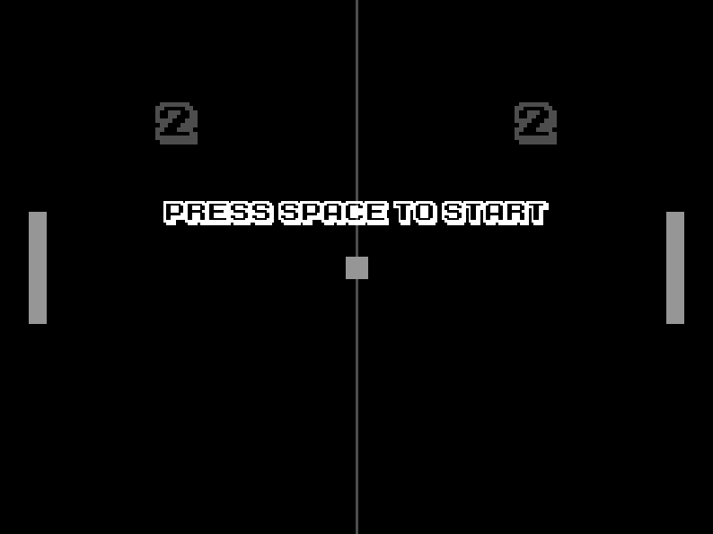
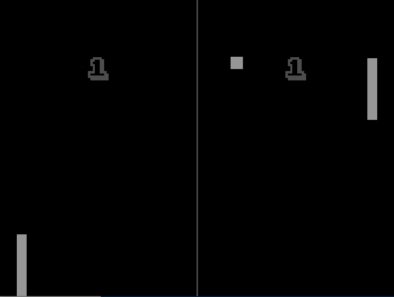
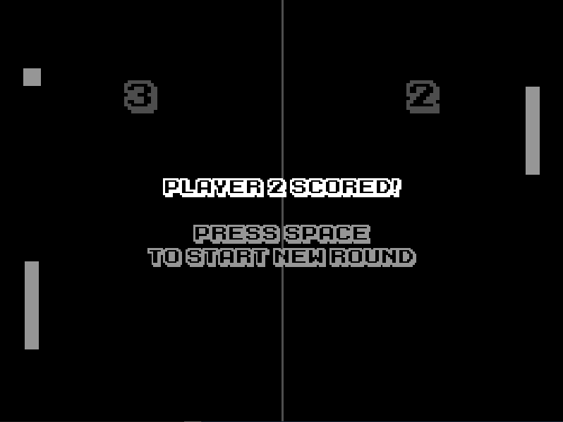

# Py-Pong!
Pong clone made in Python (hence the name "Py(thon)-Pong!")
Created in about 3 days using Python 3.10 and pygame
<br>


## Requirements
Python 3.10 installed on your system
(preferrably with an entry in your system's PATH environment variable as well)

## How to play
1. Open the **terminal** in the directory where you want the game to be and clone this repository:
```bash
git clone https://github.com/novacti3/py-pong "Py-Pong"
```
2. Navigate to the **game's directory**:
```bash
cd Py-Pong
```
3. **Launch** the file `main.py`:
```bash
python main.py
```

The game is intended for **two** players:
Player one controls the left paddle
Player two controls the right paddle

The game **doesn't have an end** to it. You play for as long as you feel like.

### Controls
**Player one:**
W - move paddle up
S - move paddle down

**Player two:**
Up arrow - move paddle up
Down arrow - move paddle down

**General**
Spacebar - continue
Escape - quit the game (at any point)


## Images




## Special thanks
Thank you to Vic Fieger for creating the awesome font "<a href="https://www.1001freefonts.com/karmatic-arcade.font">Karmatic Arcade</a>"